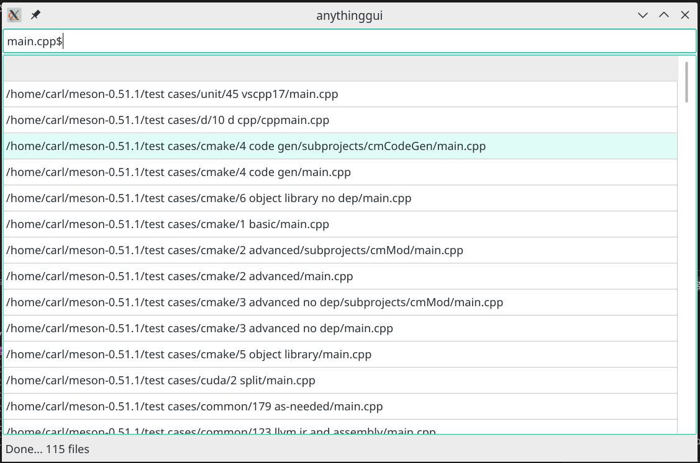

# Anything

## 1. Overview 

This is a `everything` like tool that fully opensource and ~~crossplatform~~, as you might have got the idea from the project name ; ).


First of all, I have to say sorry, for I am not very familiar with GUI programming, so..., the sample GUI is kind of ~~ugly~~ simple, but indeed it shows the most important (the only) feature - File Searching!


This program can get you what you want in real-time.




## 2. ~~Magic~~ behind the user interface.

If you have ever used `everything`, you might be shocked by the power that it can fetch what you want in no time! So do I. And My intuition is that there must be some magic power with `everything`, it's impossible for Brute-force search algorithms to have such good performance.


But after I wrote a test brute-force program, I found it is much faster than I though! So, the conclusion is...


There is no brilliant idea nor magic behind the UI, all the program did is matching all file names in a brute-force manner, in other words, the simplified pseudo-code is:

```
input: MyPattern

foreach file in AllFilesOnDisk {
    if (file.name matches MyPattern) {
        display(filename)
    }
}
```

Just try it! Brute-force matching is not as slow as we expected!


## 3. Additions

### 3.1. I decide to use PCRE instead of C++ std::regex

Because std::regex seems to be too slow. When I use std::regex, it take serveral seconds to match all files on my disk. On the other hand, after I replace std::regex with PCRE, matching all files on my disk takes no time!

### 3.2. The QT base GUI sample rebuild the data base every 30 minutes.

To begin with, I'd like to use file watcher, but it turns out that adding file watcher to the whole disk on linux is nearly impossible! We must recursively add watcher on all directories, obviously it's not a good idea.  Thus, my final solution is rebuild the data base all the time(P.S. Is there any better work around?)


# 4. Feel free to contribute your idea!

Let's make a better tool!